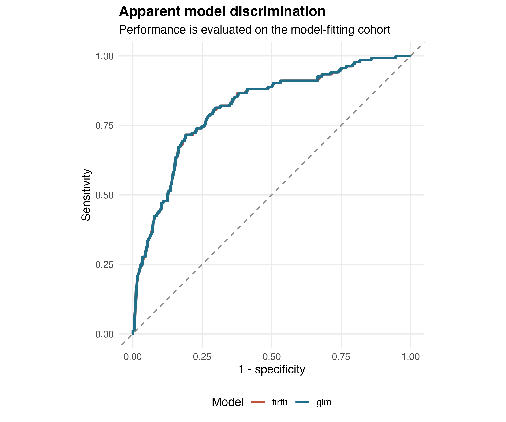

# ClinRiskR

Reproducible, privacy-conscious binary outcome analysis for small clinical
cohorts.

[简体中文](README.zh-CN.md)

> **Research use only.** ClinRiskR is not a medical device and must not be used
> for diagnosis, treatment selection, or individual clinical decisions.

ClinRiskR turns a documented table and a small configuration file into an
auditable analysis bundle. It was created from a hypertensive-disorders-of-
pregnancy research workflow, but the analysis engine is intentionally generic.
The included demonstration cohort is fully synthetic and represents no real
patients.

## Why this project

Small clinical studies often need the same careful steps: schema checks,
missingness review, a baseline table, stable estimation when events are sparse,
and enough metadata to reproduce every output. These steps are frequently
reimplemented in one-off scripts with machine-specific paths.

ClinRiskR packages that workflow into reusable functions and a command-line
entry point. It favors explicit assumptions and inspectable CSV outputs over a
black-box score.

## What it does

- Validates IDs, binary outcomes, variable roles, missingness, and model inputs.
- Produces outcome-stratified descriptive statistics with missing values shown.
- Fits conventional logistic regression and Firth penalized logistic
  regression from the same declared formula.
- Reports apparent AUC, Brier score, Youden threshold, sensitivity,
  specificity, and simple calibration estimates.
- Exports CSV tables, an Excel workbook, publication-ready figures, the exact
  configuration, session information, and checksums.
- Keeps input data local and does not copy them into results.
- Excludes row-level predictions unless the user explicitly opts in.

## Quick start

Requirements: R 4.1 or newer and a working C/C++ build toolchain for package
dependencies.

~~~sh
R CMD INSTALL .
Rscript scripts/run_example.R
~~~

The example creates a timestamped folder under examples/results. It uses a
fixed random seed, injects realistic low-level missingness, and writes only
aggregate outputs.

The same workflow can be called from R:

~~~r
library(clinriskr)

cohort <- simulate_hdp_data(n = 420, seed = 20260502)
result <- run_clinrisk_analysis(
  data = cohort,
  config = default_hdp_config(),
  output_dir = "results/example"
)

result$performance
~~~

## Analyze your own cohort

1. Put private source files under private-data, which is ignored by Git.
2. Copy config/example_config.json and update the column names and predictors.
3. Run the command below.

~~~sh
Rscript scripts/run_analysis.R \
  private-data/cohort.xlsx \
  config/my_config.json \
  results/my-analysis
~~~

The outcome must be coded 0 for non-event and 1 for event. CSV, TSV, XLS, and
XLSX inputs are supported. To deliberately export IDs and row-level predicted
probabilities, append the flag --export-predictions. Review institutional
privacy rules before doing so.

## Output contract

Each run contains:

~~~text
results/
├── figures/
│   ├── firth_forest.pdf
│   ├── firth_forest.png
│   ├── roc_curves.pdf
│   └── roc_curves.png
├── metadata/
│   ├── analysis_config.json
│   ├── run_metadata.json
│   └── session_info.txt
├── tables/
│   ├── analysis_summary.xlsx
│   ├── apparent_performance.csv
│   ├── baseline_by_outcome.csv
│   ├── missingness.csv
│   ├── model_coefficients.csv
│   └── model_info.csv
└── manifest.csv
~~~

The manifest records file sizes, MD5 checksums, and whether a file contains
row-level data.

## Interpretation

Performance metrics are calculated on the same complete cases used to fit each
model. They are therefore apparent, optimistic estimates rather than external
validation. Missing predictor values are handled with complete-case analysis in
version 0.1.0. Read [Statistical methods](docs/statistical-methods.md) before
using the workflow in a study.

## Project status

Version 0.1.0 is an experimental public foundation. The next priorities are
bootstrap internal validation, multiple imputation hooks, configurable
transformations, and independent example datasets. See [ROADMAP.md](ROADMAP.md).

Contributions, reproducible bug reports, documentation improvements, and
validation studies are welcome. Start with [CONTRIBUTING.md](CONTRIBUTING.md).

## License

MIT. See [LICENSE.md](LICENSE.md).
